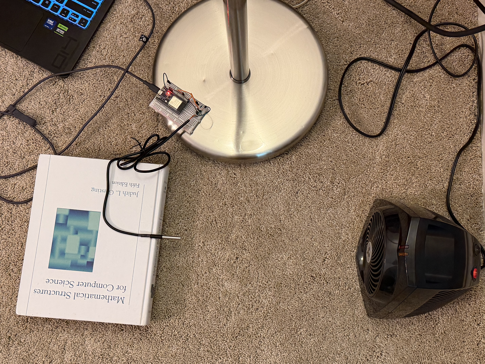
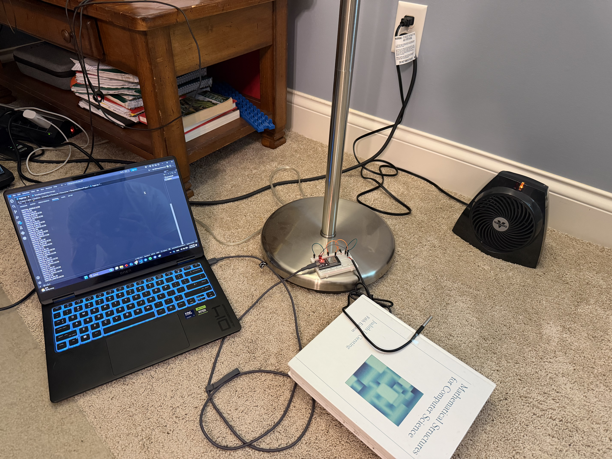
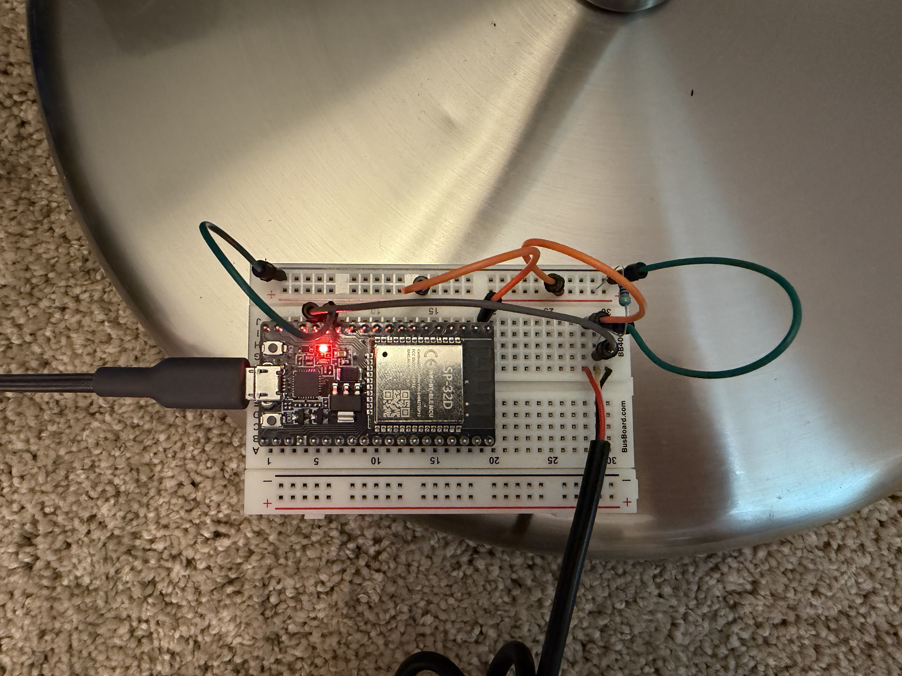
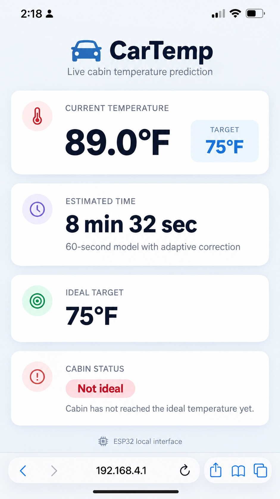

# Car Cabin Temperature Prediction System

An ESP32-based embedded temperature prediction system that uses a DS18B20 sensor, Newton's Law of Cooling/Heating, adaptive correction, and real-time data logging to estimate how long a vehicle cabin will take to approach a target temperature.



## Overview

This project was developed to explore whether a low-cost embedded system could predict vehicle cabin temperature changes using real-time sensor data.

The ESP32 collects temperature measurements from a DS18B20 sensor, estimates the thermal response of the cabin using a Newton-based exponential model, generates an initial completion-time prediction, and continuously corrects that prediction as more data becomes available.

The project progressed through multiple algorithm versions focused on:

- improving prediction accuracy
- reducing unstable prediction changes
- filtering unreliable startup data
- improving robustness in real vehicle conditions
- balancing prediction speed with consistency

The latest fully implemented and vehicle-tested version is **V5.2**. A V6.0 local-`k` limiter was designed as a possible next step but was not implemented or experimentally evaluated.

## System Architecture

```text
DS18B20 Temperature Sensor
          |
          v
        ESP32
          |
          v
Temperature Sampling
          |
          v
Initial k Estimation
          |
          v
30 / 45 / 60 Second Predictions
          |
          v
Adaptive Newton Correction
          |
          +----------------------+
          |                      |
          v                      v
   Local Web Interface      Serial Output
                                 |
                                 v
                          Python Data Logger
                                 |
                                 v
                         Experimental Data
```



## Hardware

- ESP32 WROOM development board
- DS18B20 digital temperature sensor
- OneWire communication
- Breadboard and jumper wiring
- USB serial connection for experimental logging



## Prediction Model

The system is based on Newton's Law of Cooling/Heating:

```text
T(t) - Ta = (T0 - Ta)e^(-kt)
```

where:

- `T(t)` is the measured temperature
- `Ta` is the ambient/reference temperature
- `T0` is the initial temperature
- `k` represents the thermal response of the system

The exponential relationship is transformed into a linear regression problem so that `k` can be estimated from measured temperature data.

The predicted completion time is then calculated using the estimated value of `k`.

## Current V5.2 Algorithm

The current tested implementation focuses on improving the initial estimate by removing unreliable startup data while retaining adaptive Newton correction.

### Initial prediction

1. Collect temperature samples.
2. Exclude the first 20 seconds from the initial `k` calculation.
3. Calculate the initial Newton-model `k` from post-startup temperature data using the V5.2 weighted approach.
4. Generate initial predictions at:
   - 30 seconds
   - 45 seconds
   - 60 seconds

The 15-second model used in earlier versions was removed because it falls inside the startup period that testing identified as unreliable.

### Adaptive correction

After an initial prediction is generated, the system continues updating the Newton model as new temperature data becomes available.

The adaptive stage retains the stabilization methods developed in the V2-V4.x iterations, including adaptive `k` smoothing/limiting and prediction-change limiting. These mechanisms allow the prediction to respond to new information while reducing unrealistic jumps.

### Planned V6.0 direction

A possible V6.0 improvement was designed on paper after V5.2. The proposed approach would calculate local `k` values over consecutive 5-second intervals after the 20-second startup exclusion and limit changes between accepted values.

This V6.0 approach was **not implemented or experimentally evaluated**, so it is presented only as future work rather than as a completed version.

## Testing

Development included both controlled heating experiments and real vehicle testing.

Early controlled testing demonstrated that adaptive correction substantially improved prediction accuracy. In one 10-test evaluation, average prediction error decreased from **18.34% initially to 4.73% after adaptive correction**, a 74.2% reduction in average error.

Later testing moved into a vehicle environment with the sensor positioned near the driver's seating area rather than directly beside the HVAC output. This allowed the system to measure temperature changes closer to what an occupant would actually experience.

V5.2 vehicle testing compared 30-, 45-, and 60-second prediction windows using the same temperature curve for each test. This reduced experimental differences between model comparisons and showed that longer initial sampling generally produced more consistent initial predictions.


V5.2 is the latest completed and vehicle-tested version. The proposed V6.0 local-`k` limiter remains future work and is not presented as an implemented or validated improvement.

## Web Interface

The ESP32 creates a local Wi-Fi access point and hosts a browser-based interface displaying:

- current cabin temperature
- estimated time remaining
- estimated target time
- current temperature status



*Current UI prototype image; the web interface is still being redesigned.*

## Data Logging

A Python serial logger records experiment data from the ESP32.

The logger stores:

- elapsed experiment time
- temperature samples
- initial predictions
- adaptive correction updates
- actual completion time
- initial prediction error
- final prediction error

This allowed algorithm changes to be evaluated using recorded experimental data instead of relying only on visual observations.

## Development

The system went through several major iterations:

| Version | Main Improvement |
|---|---|
| V1 | Basic adaptive Newton correction |
| V2 | Adaptive `k` smoothing |
| V3.1 | ±20% adaptive `k` limiter |
| V3.2 | ±10% adaptive `k` limiter |
| V4.1 | Prediction-change limiter |
| V4.2 | Improved adaptive prediction stability |
| V5.0 / V5.1 | Weighted initial `k` investigation |
| V5.2 | Removed unstable first 20 seconds |
| Planned V6.0 | Proposed consecutive 5-second initial `k` calculations with ±30% limiting |

The development process increasingly prioritized **robustness and consistency over unnecessary model complexity**.

For the complete development process, see:

[Development History](docs/development-history.md)

## Repository Structure

```text
.
├── firmware/
│   └── CarCabinTemperaturePredictionSystem.cpp
│
├── data_logger/
│   ├── logger.py
│   └── README.md
│
├── sample_data/
│   ├── v5.2_adaptive_correction_45s.xlsx
│   ├── v5.2_initial_model_45s.xlsx
│   ├── v5.2_vehicle_test_conditions.xlsx
│   └── README.md
│
├── docs/
│   ├── development-history.md
│   ├── system-design.md
│   └── testing-results.md
│
├── images/
│
├── .gitignore
└── README.md
```

## Documentation

More detailed documentation is available here:

- [System Design](docs/system-design.md)
- [Development History](docs/development-history.md)
- [Testing Results](docs/testing-results.md)
- [Firmware Documentation](firmware/README.md)
- [Data Logger Documentation](data_logger/README.md)
- [Sample Data](sample_data/README.md)

## Technologies

- C++
- Python
- ESP32
- DS18B20
- OneWire
- Serial communication
- HTML / JavaScript
- Embedded web server
- Newton's Law of Cooling/Heating
- Linear regression
- Experimental data analysis

## Current Status

The latest completed and vehicle-tested version is V5.2. It combines:

- startup-data filtering
- 30 / 45 / 60 second initial predictions
- adaptive Newton correction
- prediction stabilization
- serial experimental logging
- local web-based output

Current next steps are:

- redesign and polish the web interface
- add a clear photo of the installed prototype inside the vehicle
- update the firmware cleanly around the finalized V5.2 baseline
- optionally implement and test the proposed V6.0 consecutive local-`k` limiter in a future development cycle
