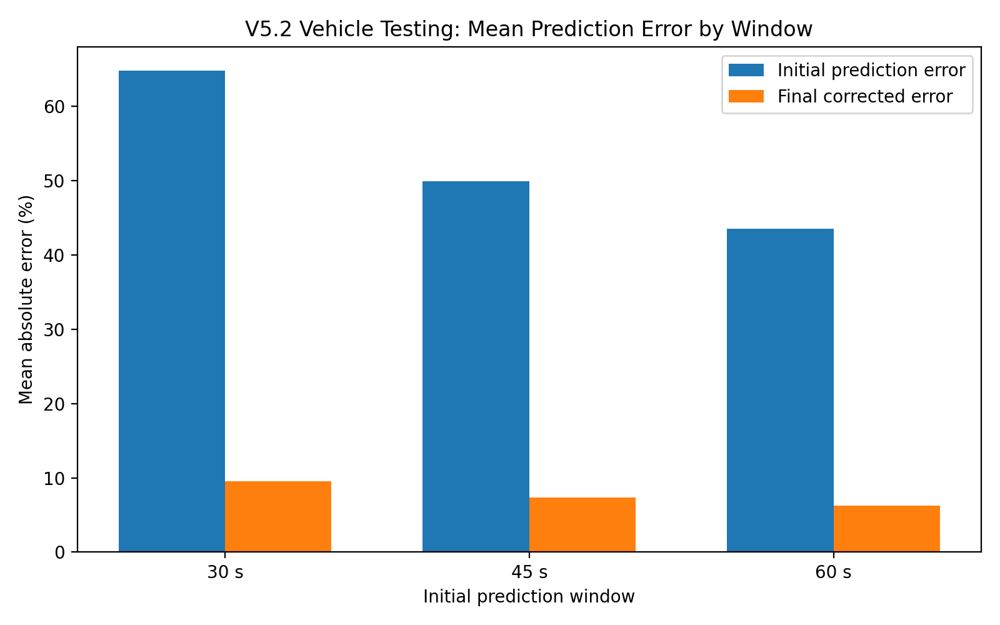
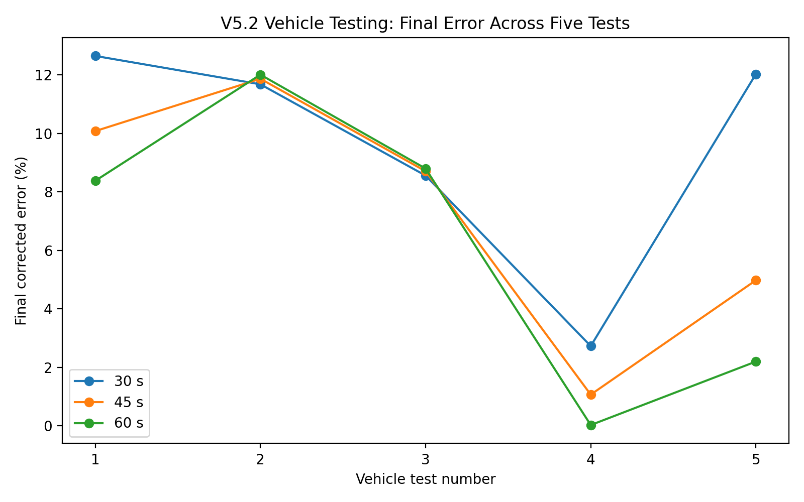
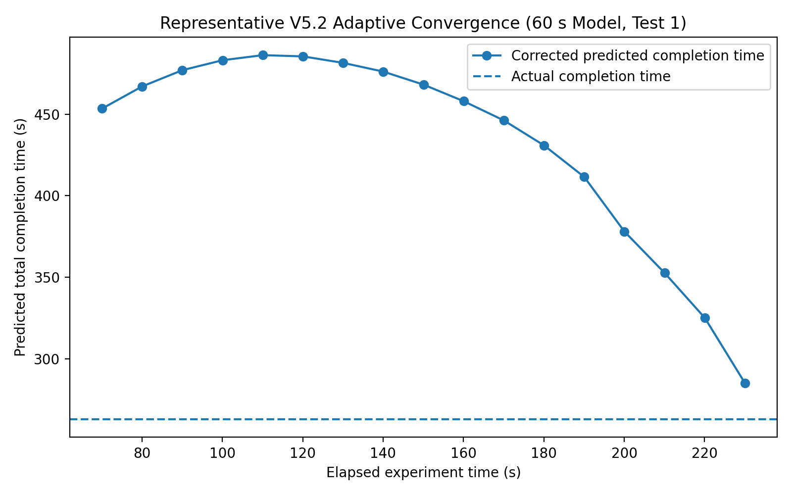

# Testing Results

## Overview

Testing was performed in two stages:

1. **Controlled testing** using a repeatable heating setup to evaluate algorithm behavior.
2. **Vehicle testing** to evaluate prediction performance under more realistic cabin conditions.

The project gradually moved away from comparing models across separate experimental batches and toward evaluating multiple prediction windows on the **same temperature experiment**.

This is important because different experiments can have different:

- starting temperatures,
- airflow,
- heater output,
- environmental temperature,
- sunlight,
- sensor response.

Using the same heating/cooling curve for multiple prediction windows makes the comparison more meaningful.

---

## Controlled Test Procedure

Early controlled testing used a fixed sensor and heating-source geometry.

The recorded procedure included:

- fixed heat-source mode,
- approximately 30 cm from heater to sensor,
- approximately 6 cm sensor height,
- a defined heating / cooldown routine between tests,
- serial logging through `logger.py`.

Controlled testing was mainly used to:

- compare mathematical models,
- debug algorithm changes,
- evaluate adaptive correction behavior,
- investigate prediction instability.

---

## Early Adaptive Model Baseline

The earliest repeated adaptive Newton dataset contained 10 controlled tests.

The results were:

| Metric | Result |
|---|---:|
| Number of tests | 10 |
| Average initial prediction error | 18.34% |
| Standard deviation of initial error | 11.75% |
| Average final prediction error | 4.73% |
| Standard deviation of final error | 2.69% |
| Maximum final prediction error | 9.54% |
| Minimum final prediction error | 0.05% |
| Relative reduction in average error | 74.2% |

### Interpretation

The adaptive model dramatically improved the average result.

However, the important weakness was **intermediate instability**. Some correction updates initially moved the prediction farther from the actual result before later converging.

This observation directly motivated the V2–V4 stability work:

- adaptive `k` smoothing,
- adaptive `k` limiting,
- prediction-change limiting.

---

## Transition to Vehicle Testing

Controlled testing was useful for algorithm development, but it could not reproduce the full variability of a vehicle cabin.

For vehicle testing, the sensor was placed near the driver's seating / upper-body area rather than directly near the HVAC outlet.

This made the measurement more representative of the temperature experienced by an occupant.

Vehicle testing introduced real-world variability including:

- different outside temperatures,
- sunlight exposure,
- changing wind and humidity,
- cabin airflow,
- heat distribution,
- different heating/cooling durations.

Because of this variability, results from **different version test days should not be treated as perfectly controlled head-to-head comparisons**.

The strongest comparisons are between prediction windows generated from the same set of tests.

---

# V5.2 Vehicle Testing

V5.2 is the latest version for which a complete repeated vehicle dataset was collected.

Five vehicle tests were performed for each of the remaining prediction windows:

- 30 seconds
- 45 seconds
- 60 seconds

The same underlying experiment was used for each window within a test.

## Aggregate Results

| Prediction Window | Tests | Mean Initial Error | Initial Error SD | Mean Final Error | Final Error SD | Mean Prediction Change |
|---|---:|---:|---:|---:|---:|---:|
| 30 s | 5 | 64.76% | 41.02% | 9.53% | 4.12% | 42.21% |
| 45 s | 5 | 49.86% | 27.30% | 7.34% | 4.32% | 37.18% |
| 60 s | 5 | 43.52% | 22.57% | 6.28% | 4.98% | 36.00% |



### Interpretation

Within this five-test V5.2 dataset, waiting longer before generating the first prediction generally improved initial accuracy:

```text
30 s initial error: 64.76%
45 s initial error: 49.86%
60 s initial error: 43.52%
```

The 60-second window also had the lowest initial-error standard deviation of the three.

This supports the idea that additional temperature data helps the initial Newton model better represent the longer-term cabin thermal response.

However, a longer prediction window also means the user must wait longer before receiving the first estimate. Therefore, model selection is not based on error alone; it is a tradeoff between:

- waiting time,
- initial accuracy,
- consistency,
- adaptive correction performance.

---

## Final Corrected Error by Test

| Test | 30 s Final Error | 45 s Final Error | 60 s Final Error |
|---:|---:|---:|---:|
| 1 | 12.65% | 10.08% | 8.38% |
| 2 | 11.68% | 11.87% | 12.01% |
| 3 | 8.56% | 8.71% | 8.80% |
| 4 | 2.73% | 1.07% | 0.03% |
| 5 | 12.03% | 4.98% | 2.20% |



### Interpretation

Adaptive correction greatly reduced the initial errors for all three prediction windows.

The five-test averages were:

```text
30 s: 9.53% final error
45 s: 7.34% final error
60 s: 6.28% final error
```

The 60-second model had the lowest mean final error in this dataset, but the difference between windows was much smaller after adaptive correction than it was at the initial-prediction stage.

This is an important result:

> The adaptive system reduced the importance of having a perfect initial prediction, but a better initial prediction still reduced the amount of correction required.

---

## Initial vs Final Error Reduction

Using the mean errors:

| Window | Mean Initial Error | Mean Final Error | Approx. Reduction |
|---|---:|---:|---:|
| 30 s | 64.76% | 9.53% | 85.3% |
| 45 s | 49.86% | 7.34% | 85.3% |
| 60 s | 43.52% | 6.28% | 85.6% |

These reductions are calculated from:

```text
(initial error - final error) / initial error
```

They describe the decrease in mean absolute error within this dataset and should not be interpreted as a universal performance guarantee.

---

## Representative Adaptive Convergence

The following figure shows one V5.2 vehicle test using the 60-second model.

The actual completion time was approximately:

```text
263.04 seconds
```

The initial 60-second prediction was approximately:

```text
436.63 seconds
```

The adaptive system progressively reduced the estimate as additional temperature data became available.



The final stored prediction was approximately:

```text
285.07 seconds
```

which corresponds to a final absolute error of approximately:

```text
8.38%
```

This example illustrates the purpose of the adaptive system: the initial estimate can be substantially wrong, but later temperature behavior allows the model to move toward the observed completion time.

---

## V5.1 Vehicle Testing Context

V5.1 still included the 15-second model and used weighted initial `k` calculations.

Five vehicle tests were recorded.

Average initial errors were:

| Window | Mean Initial Error | Mean Final Error |
|---|---:|---:|
| 15 s | 83.69% | 10.43% |
| 30 s | 59.31% | 9.48% |
| 45 s | 48.98% | 9.19% |
| 60 s | 43.67% | 9.00% |

These results showed a strong pattern: the very early prediction windows were especially sensitive to startup behavior.

This helped motivate V5.2's decision to remove the 15-second model and exclude the first 20 seconds from the initial `k` calculation.

Because V5.1 and V5.2 were collected under different vehicle conditions, the numbers should be interpreted as development evidence rather than a perfectly controlled version-to-version benchmark.

---

## V4.2 Vehicle Testing Context

Five V4.2 vehicle tests were also recorded.

Average errors were:

| Window | Mean Initial Error | Mean Final Error |
|---|---:|---:|
| 15 s | 58.94% | 11.60% |
| 30 s | 56.58% | 11.53% |
| 45 s | 52.13% | 10.24% |
| 60 s | 48.85% | 10.12% |

Again, later prediction windows generally produced better initial estimates.

These results reinforced the conclusion that the initial prediction was more limited by early thermal data than the final adaptive model was.

---

## Why the First 20 Seconds Were Removed

Across V4.2 and V5.1 vehicle testing, the early portion of the temperature response repeatedly appeared less representative of the longer-term trend.

Observed or suspected causes included:

- sensor response delay,
- HVAC startup behavior,
- airflow stabilization,
- delayed heat transfer to the sensor location,
- transient cabin thermal behavior.

V5.2 therefore changed the strategy from **down-weighting** early data to **excluding** it.

That decision also eliminated the 15-second model.

---

## Planned V6.0 Testing

After V5.2, a possible V6.0 local-`k` limiter was designed as a future experiment. The proposed approach would:

- continue excluding the first 20 seconds,
- calculate local `k` values over consecutive 5-second intervals,
- limit changes between accepted local `k` values to approximately ±30%,
- continue using the 30 / 45 / 60 second prediction windows,
- retain the adaptive correction stage after the initial prediction.

This design was **not implemented or experimentally tested**, so there is no V6.0 result dataset and this repository makes no quantitative V6.0 performance claims.

If this version is implemented later, the appropriate experiment would record:

- raw `k` for each 5-second interval,
- accepted `k`,
- initial prediction error,
- final prediction error,
- correction magnitude,
- environmental conditions.

---

## Main Testing Conclusions

### 1. Adaptive correction is effective

Across multiple testing stages, adaptive prediction updates substantially reduced error compared with the first prediction.

### 2. Initial prediction is the harder problem

The adaptive model can recover from a poor starting estimate, but early prediction accuracy is strongly affected by transient temperature behavior.

### 3. More initial data generally improves accuracy

Within the V5.2 same-test comparison, the 60-second model produced the lowest mean initial error and lowest initial-error standard deviation.

### 4. Early startup data was unreliable

Vehicle testing motivated removing the first 20 seconds rather than continuing to include it with reduced weighting.

### 5. Model complexity was not automatically beneficial

Dynamic ambient estimation was rejected because it added sensitivity without producing sufficiently consistent behavior.

### 6. Experimental design improved during the project

Later testing generated multiple prediction-window outputs from the same temperature experiment, reducing environmental differences between model comparisons.

### 7. V6.0 remains future work

The consecutive local-`k` limiter was designed as a possible next experiment but was not implemented. V5.2 therefore remains the latest completed and vehicle-tested version documented by the project.
